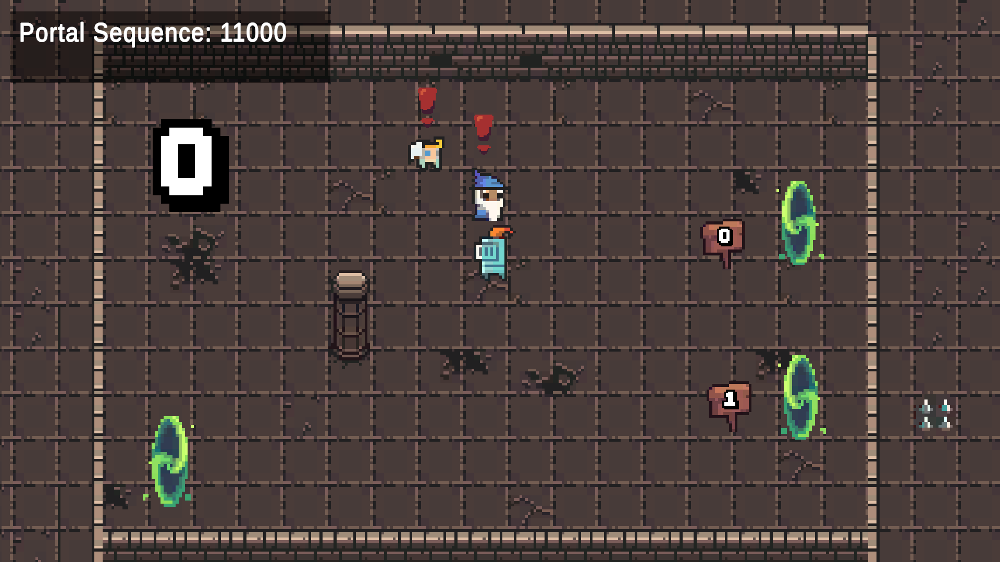
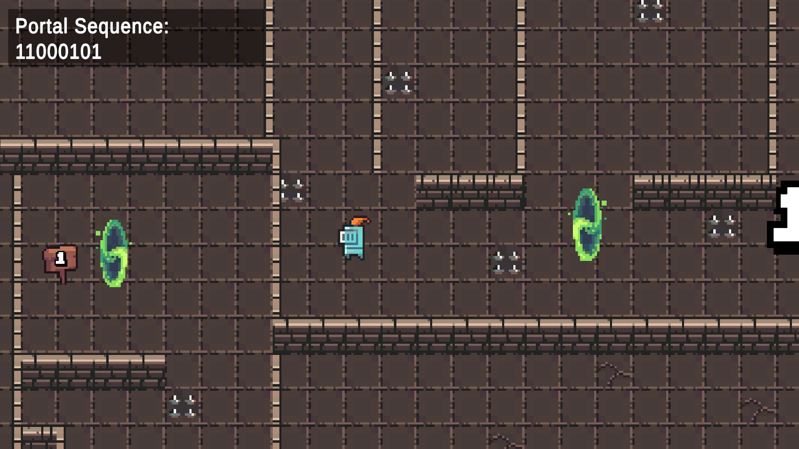
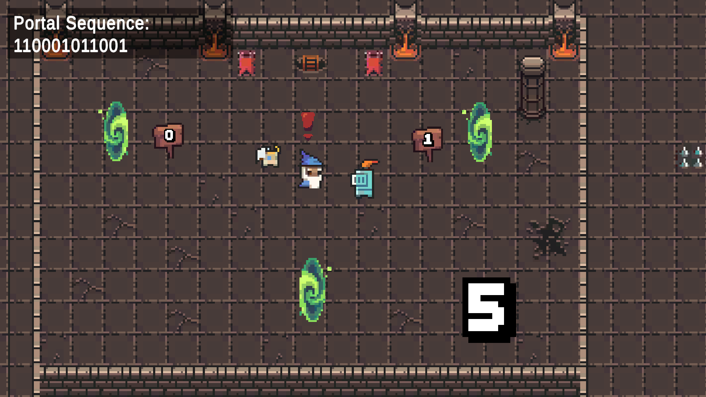
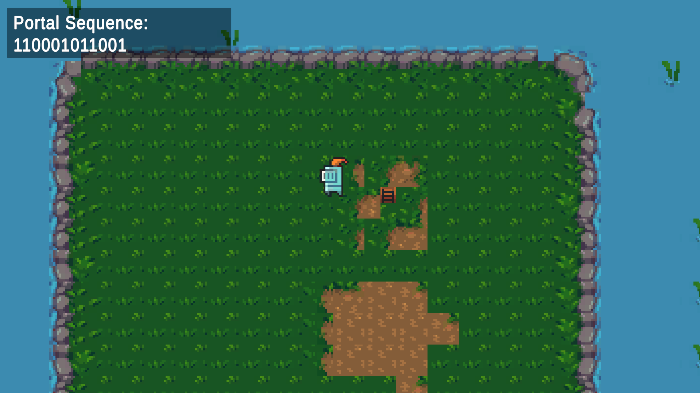

## Preview

(School project) Built in Unity using C#, I made an Automata Theorem game where the player should enter the correct valid string in order to win the maze game.

## Gameplay Preview #1

## Gameplay Preview #2

## Screenshots

